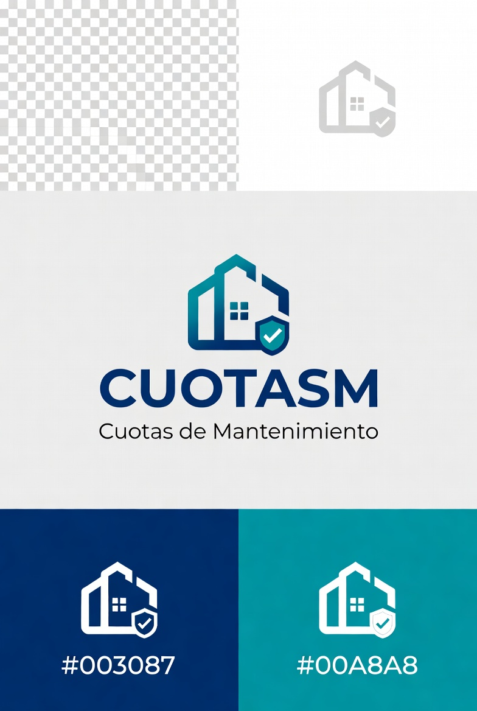

  
  <h1>CuotasM</h1>
  
<strong>🏘️ Cuotas de Mantenimiento</strong>

  
Plataforma integral para la gestión de pagos y cobros en condominios

 

Plataforma integral para la gestión de pagos y cobros en unidades habitacionales o condominios, diseñada especialmente para comunidades residenciales pequeñas. 📍 Con sede en **Santiago de Querétaro, México**.

> 💡 Gestionar pagos y cobros en condominios puede ser complicado. Por eso desarrollamos una aplicación que simplifica y automatiza este proceso.

---

## 📚 Contenido

- [🚀 Conoce la aplicación →](pages/sistema.md) — Dashboard, catálogo de casas, ingresos/egresos, estados de cuenta y videovigilancia
- [📋 Iniciar en la aplicación →](pages/iniciamos.md) — Proceso de onboarding y migración de datos
- 💰 [Costos →](pages/costos.md) — Planes de precios y módulos personalizados
- 📧 [Contacto →](pages/contacto.md) — Información de contacto y formulario

---

## 📖 Acerca del proyecto

**ing-web** es un proyecto de ☁️ *Cloud Empresarial* enfocado en proveer herramientas digitales a condominios y asociaciones civiles. La plataforma automatiza la generación de estados de cuenta, el envío de correos, el control de ingresos y egresos, y más.

📬 Para más información: [ing-web@ingeniero-web.com](mailto:ingweb054@gmail.com)

---

  © 2026 Cloud Empresarial. Todos los derechos reservados.

