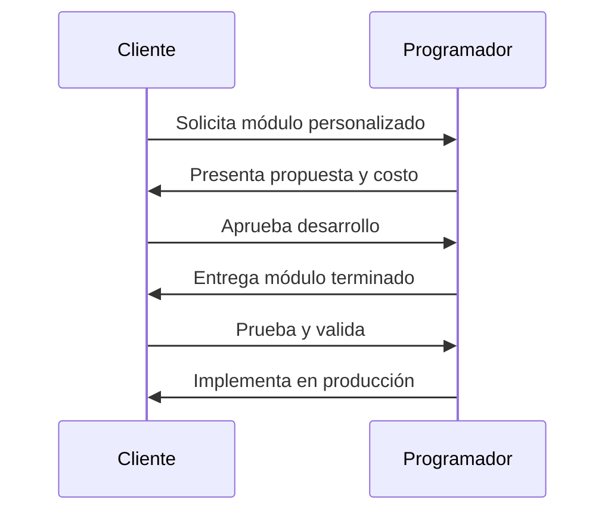

# Costos de la aplicación

Precios anuales basados en el número de casas del condominio. Incluye soporte técnico y actualizaciones.

---

## Planes anuales

| Casas | Precio anual (USD) |
|-------|-------------------:|
| 1–67  | $600              |
| 68–100 | $800              |
| 101–200 | $1,000           |

> Los precios incluyen la plataforma completa, migración de datos inicial y soporte técnico.

---

## Módulos personalizados

Módulos adicionales que pueden adquirirse por separado para extender la funcionalidad de la plataforma.

| Módulo | Precio (USD) |
|--------|-------------:|
| Básico | $300         |
| Medio  | $600         |
| Premium | $1,000      |

**Flujo de desarrollo de módulos personalizados:**

---

## Cuenta de correo para el condominio

Módulo gratuito que incluye:

- 20 cuentas de correo electrónico con dominio personalizado
- Auto-respondedores automáticos
- Acceso vía URL web
- Comunicación centralizada para la mesa directiva

**Características:**

| Función | Descripción |
|---------|-------------|
| Auto-respuesta | Respuesta automática a mensajes entrantes |
| Múltiples cuentas | Hasta 20 cuentas para miembros de la mesa directiva |
| Acceso web | Bandeja de entrada accesible desde cualquier navegador |
| Centralizado | Toda la comunicación del condominio en un solo lugar |

---

[← Volver al inicio](../README.md)
