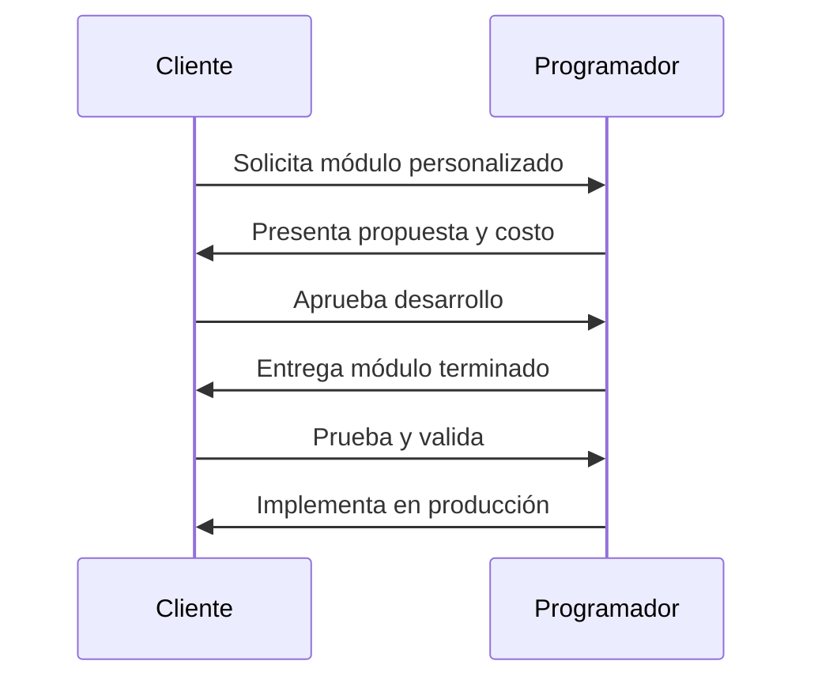

  <h1>💰 Costos de la aplicación</h1>
  
Precios anuales basados en el número de casas del condominio. Incluye soporte técnico y actualizaciones.

---

## 📋 Planes anuales

  <table>
    <tr>
      <th align="center">Casas</th>
      <th align="center">Precio anual (USD)</th>
      <th align="center">Recomendado</th>
    </tr>
    <tr>
      <td align="center">1 – 67</td>
      <td align="center"><strong>$600</strong></td>
      <td align="center">—</td>
    </tr>
    <tr>
      <td align="center">68 – 100</td>
      <td align="center"><strong>$800</strong></td>
      <td align="center">—</td>
    </tr>
    <tr>
      <td align="center">101 – 200</td>
      <td align="center"><strong>$1,000</strong></td>
      <td align="center">✅</td>
    </tr>
  </table>

> [!NOTE]
> Todos los planes incluyen: plataforma completa, migración de datos inicial y soporte técnico durante la vigencia.

---

## 🧩 Módulos personalizados

Módulos adicionales que pueden adquirirse por separado para extender la funcionalidad de la plataforma.

  <table>
    <tr>
      <th align="center">Módulo</th>
      <th align="center">Precio (USD)</th>
      <th align="center">Descripción</th>
    </tr>
    <tr>
      <td align="center"><strong>Básico</strong></td>
      <td align="center">$300</td>
      <td>Funcionalidad adicional simple (ej. reporte personalizado)</td>
    </tr>
    <tr>
      <td align="center"><strong>Medio</strong></td>
      <td align="center">$600</td>
      <td>Integraciones con servicios externos o módulo nuevo de tamaño medio</td>
    </tr>
    <tr>
      <td align="center"><strong>Premium</strong></td>
      <td align="center">$1,000</td>
      <td>Módulo completo nuevo con interfaz, lógica de negocio y reportes</td>
    </tr>
  </table>

### Flujo de desarrollo de un módulo personalizado

---

## 📬 Cuenta de correo para el condominio

> [!TIP]
> **¡Incluido sin costo adicional!**

Módulo de correo electrónico corporativo que se entrega con cada plan.

| Función | Descripción |
|---------|-------------|
| 👥 **Múltiples cuentas** | Hasta 20 cuentas para miembros de la mesa directiva |
| 🌐 **Dominio personalizado** | Correos con el nombre de tu condominio |
| 🤖 **Auto-respuesta** | Respuesta automática a mensajes entrantes en cada cuenta |
| 🖥️ **Acceso web** | Bandeja de entrada accesible desde cualquier navegador |
| 📍 **Centralizado** | Toda la comunicación del condominio en un solo lugar |

---

## ❓ Preguntas frecuentes

<strong>¿Hay cargos ocultos o costos de instalación?</strong>

No. El precio anual incluye todo: plataforma, migración inicial, soporte y actualizaciones. No hay cargos de instalación ni cargos ocultos.

<strong>¿Puedo cambiar de plan si mi condominio crece?</strong>

Sí. Si tu condominio supera el número de casas del plan contratado, puedes migrar al plan superior en cualquier momento. El ajuste se prorratea.

<strong>¿Qué incluye el soporte técnico?</strong>

El soporte cubre resolución de incidencias, asistencia en la operación diaria y actualizaciones de seguridad. El horario de atención es de lunes a viernes de 9:00 a.m. a 7:00 p.m.

<strong>¿Los datos están seguros?</strong>

Sí. La plataforma opera sobre infraestructura cloud con cifrado en tránsito (HTTPS) y en reposo. Se realizan backups automatizados diarios con retención de 7 días.

<strong>¿Se requiere firma de contrato?</strong>

Sí, se firma un contrato anual de prestación de servicios que especifica términos, alcance y responsabilidades de ambas partes.

---

  <h3>¿Listo para empezar?</h3>
  

    <a href="contacto.md"><strong>📧 Contáctanos →</strong></a>
  

   
  <a href="../README.md">← Volver al inicio</a>

