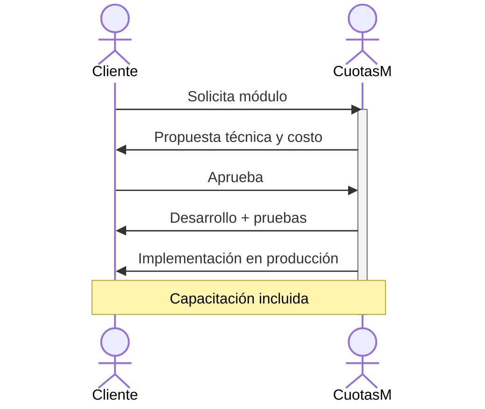

# 💰 Costos de la aplicación

Precios anuales basados en el número de casas del condominio. Incluye soporte técnico y actualizaciones.

---

## 📋 Planes anuales

| Casas | Precio anual (USD) | Recomendado |
|-------|-------------------:|:-----------:|
| 1 – 67 | **$600** | |
| 68 – 100 | **$800** | |
| 101 – 200 | **$1,000** | ✅ |

> 📌 **Nota:** Todos los planes incluyen: plataforma completa, migración de datos inicial y soporte técnico durante la vigencia.

---

## 🧩 Módulos personalizados

Módulos adicionales que pueden adquirirse por separado para extender la funcionalidad de la plataforma.

| Módulo | Precio (USD) | Descripción |
|--------|-------------:|-------------|
| **Básico** | $300 | Funcionalidad adicional simple (ej. reporte personalizado) |
| **Medio** | $600 | Integraciones con servicios externos o módulo nuevo de tamaño medio |
| **Premium** | $1,000 | Módulo completo nuevo con interfaz, lógica de negocio y reportes |

### Flujo de desarrollo de un módulo personalizado

| Paso | De | Para | Descripción |
|------|----|------|-------------|
| 1 | Cliente | CuotasM | Solicita módulo personalizado |
| 2 | CuotasM | Cliente | Envía propuesta técnica y costo |
| 3 | Cliente | CuotasM | Aprueba la propuesta |
| 4 | CuotasM | — | Desarrolla el módulo |
| 5 | CuotasM | Cliente | Entrega versión para pruebas |
| 6 | Cliente | CuotasM | Prueba y envía retroalimentación |
| 7 | CuotasM | Cliente | Realiza ajustes e implementa en producción |

---

## 📬 Cuenta de correo para el condominio

> 💡 **Tip:** ¡Incluido sin costo adicional!

Módulo de correo electrónico corporativo que se entrega con cada plan.

| Función | Descripción |
|---------|-------------|
| 👥 **Múltiples cuentas** | Hasta 20 cuentas para miembros de la mesa directiva |
| 🌐 **Dominio personalizado** | Correos con el nombre de tu condominio |
| 🤖 **Auto-respuesta** | Respuesta automática a mensajes entrantes en cada cuenta |
| 🖥️ **Acceso web** | Bandeja de entrada accesible desde cualquier navegador |
| 📍 **Centralizado** | Toda la comunicación del condominio en un solo lugar |

---

## ❓ Preguntas frecuentes

<strong>¿Hay cargos ocultos o costos de instalación?</strong>

No. El precio anual incluye todo: plataforma, migración inicial, soporte y actualizaciones. No hay cargos de instalación ni cargos ocultos.

<strong>¿Puedo cambiar de plan si mi condominio crece?</strong>

Sí. Si tu condominio supera el número de casas del plan contratado, puedes migrar al plan superior en cualquier momento. El ajuste se prorratea.

<strong>¿Qué incluye el soporte técnico?</strong>

El soporte cubre resolución de incidencias, asistencia en la operación diaria y actualizaciones de seguridad. El horario de atención es de lunes a viernes de 9:00 a.m. a 7:00 p.m.

<strong>¿Los datos están seguros?</strong>

Sí. La plataforma opera sobre infraestructura cloud con cifrado en tránsito (HTTPS) y en reposo. Se realizan backups automatizados diarios con retención de 7 días.

<strong>¿Se requiere firma de contrato?</strong>

Sí, se firma un contrato anual de prestación de servicios que especifica términos, alcance y responsabilidades de ambas partes.

---

  
<strong>¿Listo para empezar?</strong>

  
<a href="../contacto.md"><strong>📧 Contáctanos →</strong></a>

   
  <a href="../../">← Volver al inicio</a>

