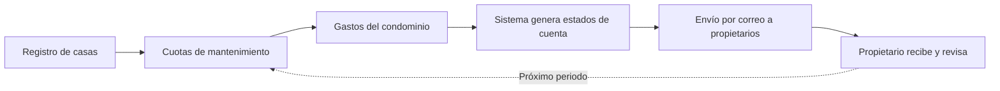

# 🚀 Conoce la aplicación

Plataforma modular para la administración de condominios. Cada módulo está diseñado para cubrir una necesidad específica de la mesa directiva y los residentes.

---

## 📊 Dashboard

Panel de control central con indicadores clave, gráficos de ingresos/egresos y acceso rápido a los módulos principales.

| Capacidad | Descripción |
|-----------|-------------|
| 📈 **Gráficos dinámicos** | Visualiza ingresos vs egresos por periodo con gráficos de barras y líneas |
| 🏠 **Saldos por casa** | Estado de cuenta resumido de cada propietario en un solo vistazo |
| ⚡ **Acceso rápido** | Enlaces directos a los módulos más utilizados |
| 🔔 **Alertas** | Notificaciones de pagos vencidos y recibos pendientes |

---

## 🏠 Catálogo de casas

Registro completo de cada unidad del condominio. Base para la generación de estados de cuenta y comunicación automatizada.

| Campo | Descripción |
|-------|-------------|
| **Número de casa** | Identificador único de cada unidad |
| **Propietario** | Nombre del dueño registrado |
| **Correo electrónico** | Para envío automatizado de estados de cuenta |
| **Teléfono** | Contacto directo para comunicados urgentes |

---

## 📂 Catálogo de ingresos y egresos

Clasificación personalizable de conceptos para mantener un control financiero ordenado.

| 💰 Ingresos | 💸 Egresos |
|---|---|
| Multas por infracciones | Recolección de basura |
| Tarjetas de acceso | Electricidad |
| Llaves de repuesto | Lectura de agua |
| Cuotas extraordinarias | Jardinería |
| Rentas de áreas comunes | Mantenimiento general |

*Catálogo de ingresos*

*Catálogo de egresos*

---

## 💳 Módulo de ingresos y egresos

Registro diario de transacciones con selección de tipo, descripción y comprobante de pago.

> 📌 **Nota:** Cada transacción puede asociarse a una imagen de comprobante, creando un **rastro auditable** de todos los movimientos financieros.

| Función | Descripción |
|---------|-------------|
| ✏️ **Registro rápido** | Formulario inteligente con autocompletado de conceptos |
| 📎 **Comprobantes** | Adjunta imágenes como respaldo de cada operación |
| 🔍 **Búsqueda y filtros** | Encuentra cualquier transacción por fecha, concepto o monto |
| 📤 **Exportación** | Descarga reportes en CSV para contabilidad externa |

---

## 📄 Generación de estados de cuenta

El sistema genera automáticamente estados de cuenta detallados para cada propietario y los envía por correo electrónico **sin intervención manual**.

### Flujo de operación

| Etapa | Detalle |
|-------|---------|
| **1** | La mesa directiva registra la información de casas y propietarios |
| **2** | Se registran las cuotas de mantenimiento periódicas |
| **3** | Se registran los gastos del condominio |
| **4** | El sistema genera los estados de cuenta automáticamente |
| **5** | Los estados de cuenta se envían por correo a cada propietario |

> 💡 **Tip:** El formato del estado de cuenta se personaliza según las necesidades de tu condominio: incluye gráficos, detalle de movimientos y saldo actual.

---

## 📡 Módulo de integración de dispositivos IoT (opcional)

Conecta tu condominio con el mundo físico. Integramos lectores de tarjetas, sirenas inteligentes, sensores y sistemas de videovigilancia basados en IA para que todo esté centralizado desde la plataforma.

### Dispositivos compatibles

| Tipo | Ejemplos | Función |
|------|----------|---------|
| **Lectores de tarjetas** | RFID, NFC, banda magnética | Control de acceso a áreas comunes (estacionamiento, gimnasio, salón de eventos) |
| **Sirenas inteligentes** | eWeLink, Sonoff | Alertas sonoras programables ante eventos de seguridad, emergencias o recordatorios |
| **Sensores IoT** | Temperatura, humo, gas, movimiento, apertura de puertas | Monitoreo en tiempo real de áreas comunes con notificaciones automáticas |
| **Actuadores** | Relés inteligentes, cerraduras eléctricas | Apertura remota de portones, cancelas y puertas desde el dashboard |

### 🎥 Videovigilancia con IA (Frigate)

La videovigilancia se maneja a través de **Frigate**, un sistema de detección de objetos con IA que corre localmente. Frigate analiza el video en tiempo real, distinguiendo personas, vehículos, animales y objetos.

| Característica | Descripción |
|---------------|-------------|
| **Detección inteligente** | IA local que distingue personas, vehículos, animales y objetos |
| **Sin falsas alarmas** | Solo notifica cuando realmente hay actividad relevante |
| **Grabación por eventos** | Almacena clips solo cuando se detecta movimiento significativo |
| **Integración total** | Acceso a cámaras en vivo, grabaciones y notificaciones desde el dashboard |
| **Notificaciones** | Alertas por correo o push al detectar eventos configurados |

### Requerimientos técnicos

| Componente | Especificación |
|------------|----------------|
| **Servidor Frigate** | Raspberry Pi 4, Jetson Nano, o servidor x86 con Coral TPU (recomendado) |
| **Almacenamiento** | Hasta 7 días de eventos históricos con grabación inteligente |
| **Cámaras compatibles** | Cualquier cámara IP RTSP (Dahua, Hilook, Hikvision, Reolink, etc.) |
| **Conectividad** | WiFi / Ethernet para dispositivos IoT |
| **Acceso** | Panel unificado desde el dashboard web |

---

  
<strong>¿Listo para digitalizar tu condominio?</strong>

  

    <a href="../iniciamos/"><strong>📋 Ver proceso de inicio →</strong></a>
    ·
    <a href="../costos/"><strong>💰 Ver planes →</strong></a>
  

   
  <a href="../../">← Volver al inicio</a>

