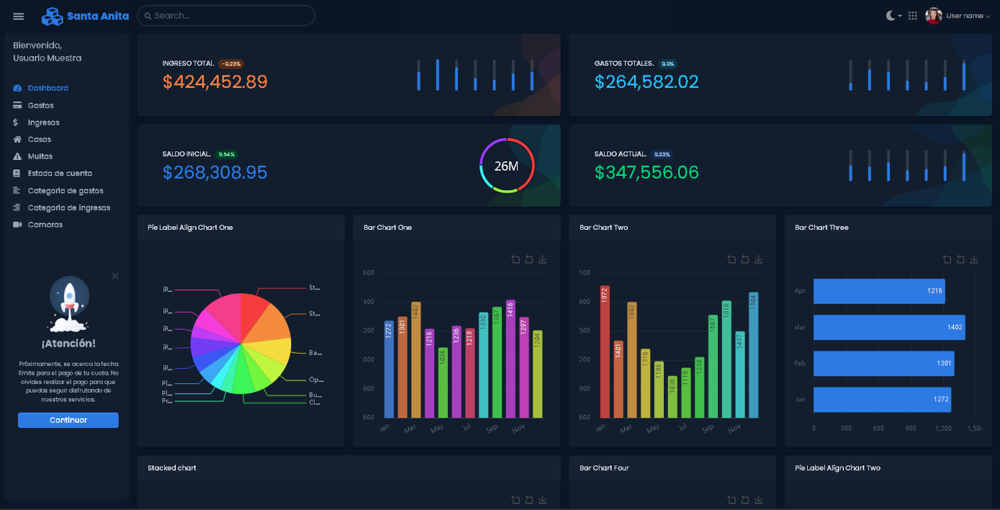
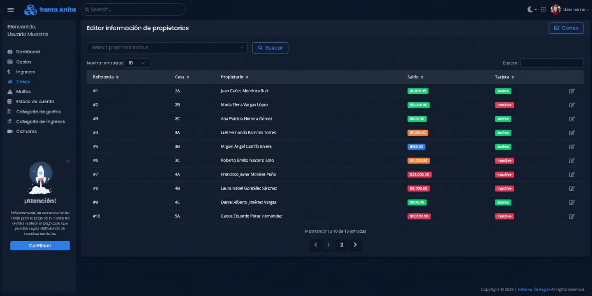
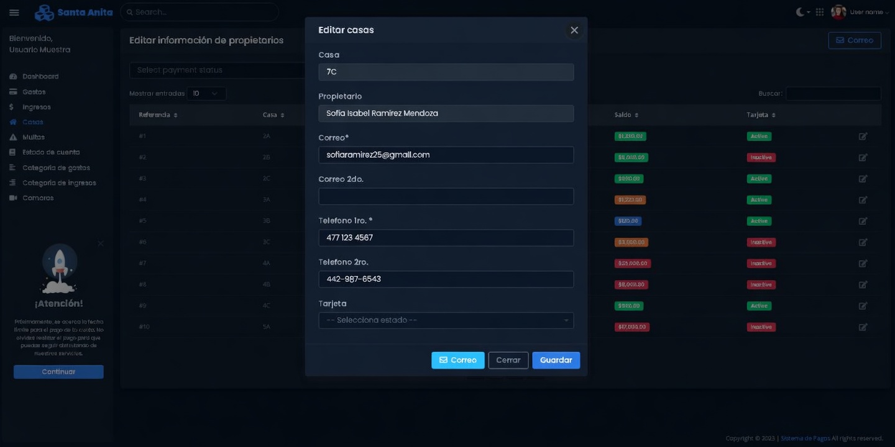
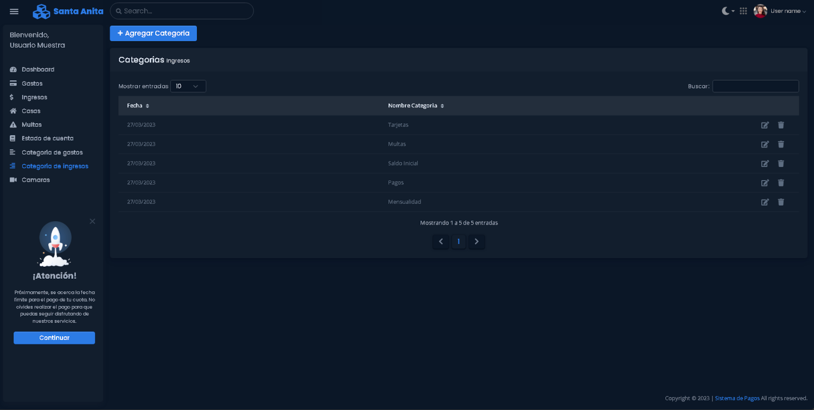
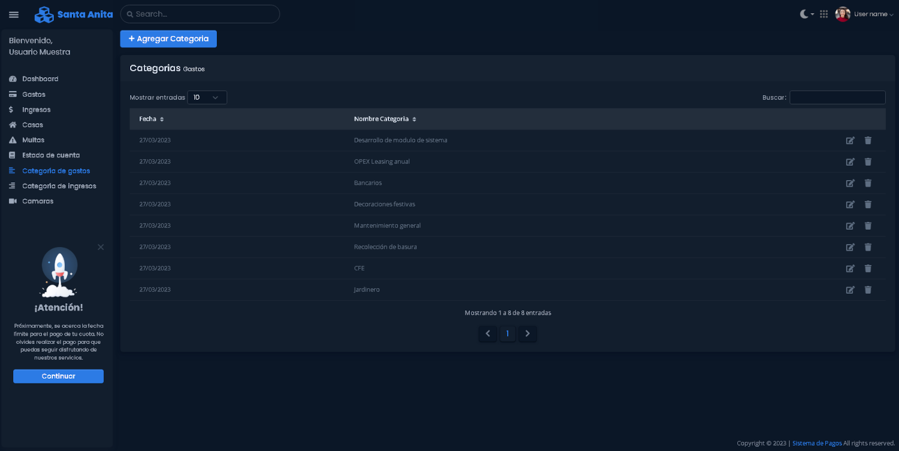
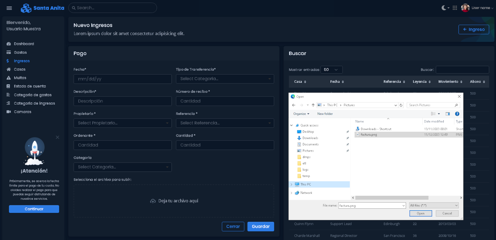
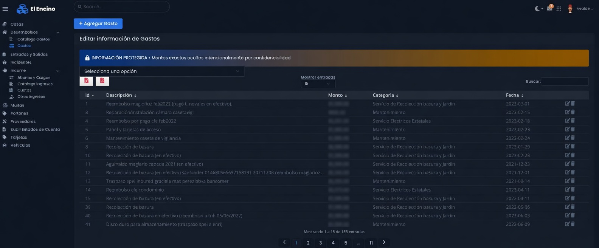
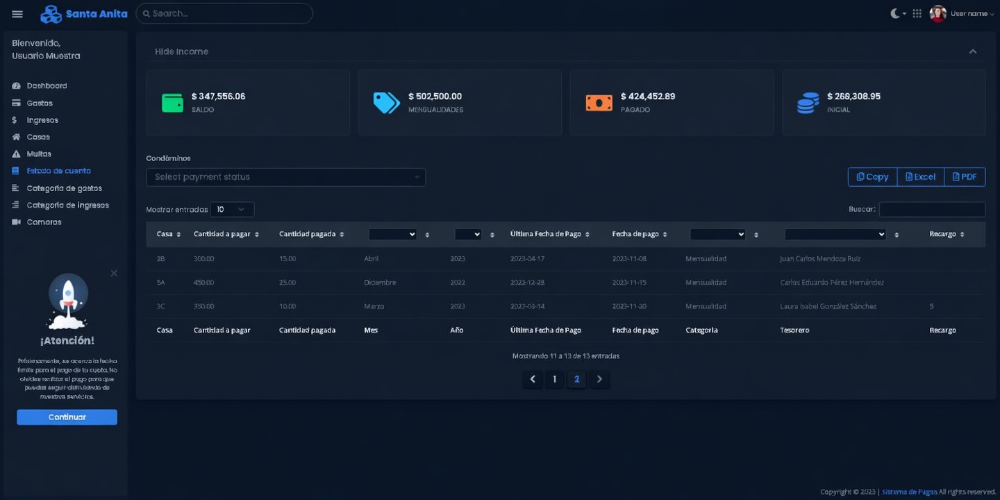
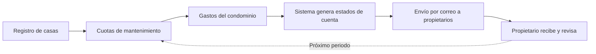
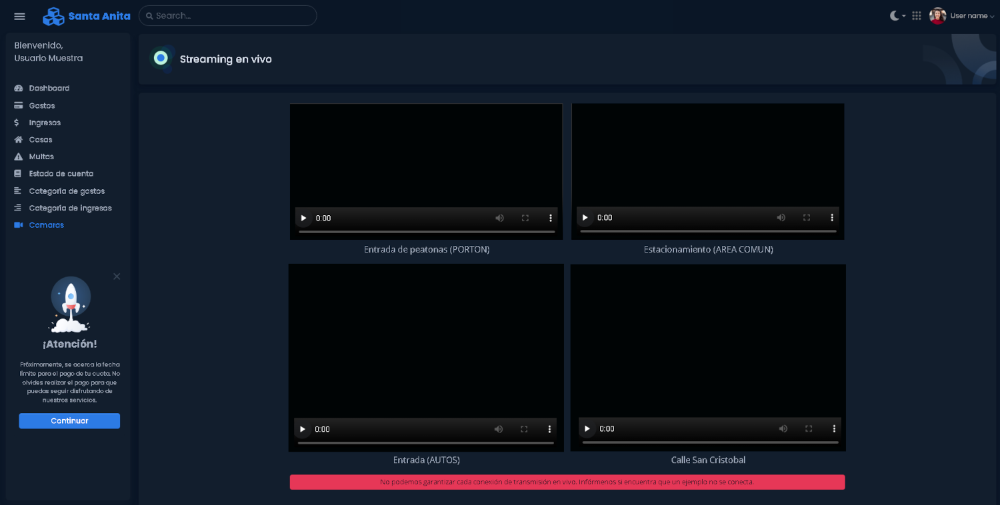

  <h1>🚀 Conoce la aplicación</h1>
  
Plataforma modular para la administración de condominios. Cada módulo está diseñado para cubrir una necesidad específica de la mesa directiva y los residentes.

---

## 📊 Dashboard

> Panel de control central con indicadores clave, gráficos de ingresos/egresos y acceso rápido a los módulos principales.

| Capacidad | Descripción |
|-----------|-------------|
| 📈 **Gráficos dinámicos** | Visualiza ingresos vs egresos por periodo con gráficos de barras y líneas |
| 🏠 **Saldos por casa** | Estado de cuenta resumido de cada propietario en un solo vistazo |
| ⚡ **Acceso rápido** | Enlaces directos a los módulos más utilizados |
| 🔔 **Alertas** | Notificaciones de pagos vencidos y recibos pendientes |

---

## 🏠 Catálogo de casas

Registro completo de cada unidad del condominio. Base para la generación de estados de cuenta y comunicación automatizada.

| Campo | Descripción |
|-------|-------------|
| **Número de casa** | Identificador único de cada unidad |
| **Propietario** | Nombre del dueño registrado |
| **Correo electrónico** | Para envío automatizado de estados de cuenta |
| **Teléfono** | Contacto directo para comunicados urgentes |

---

## 📂 Catálogo de ingresos y egresos

Clasificación personalizable de conceptos para mantener un control financiero ordenado.

  <table>
    <tr>
      <th align="center">💰 Ingresos</th>
      <th align="center">💸 Egresos</th>
    </tr>
    <tr>
      <td valign="top">
        <ul>
          <li>Multas por infracciones</li>
          <li>Tarjetas de acceso</li>
          <li>Llaves de repuesto</li>
          <li>Cuotas extraordinarias</li>
          <li>Rentas de áreas comunes</li>
        </ul>
      </td>
      <td valign="top">
        <ul>
          <li>Recolección de basura</li>
          <li>Electricidad</li>
          <li>Lectura de agua</li>
          <li>Jardinería</li>
          <li>Mantenimiento general</li>
        </ul>
      </td>
    </tr>
  </table>

| | |
|:---:|:---:|
|  |  |
| *Catálogo de ingresos* | *Catálogo de egresos* |

---

## 💳 Módulo de ingresos y egresos

Registro diario de transacciones con selección de tipo, descripción y comprobante de pago.

> [!NOTE]
> Cada transacción puede asociarse a una imagen de comprobante, creando un **rastro auditable** de todos los movimientos financieros.

| Función | Descripción |
|---------|-------------|
| ✏️ **Registro rápido** | Formulario inteligente con autocompletado de conceptos |
| 📎 **Comprobantes** | Adjunta imágenes como respaldo de cada operación |
| 🔍 **Búsqueda y filtros** | Encuentra cualquier transacción por fecha, concepto o monto |
| 📤 **Exportación** | Descarga reportes en CSV para contabilidad externa |

---

## 📄 Generación de estados de cuenta

El sistema genera automáticamente estados de cuenta detallados para cada propietario y los envía por correo electrónico **sin intervención manual**.

### Flujo de operación

| Etapa | Detalle |
|-------|---------|
| **1** | La mesa directiva registra la información de casas y propietarios |
| **2** | Se registran las cuotas de mantenimiento periódicas |
| **3** | Se registran los gastos del condominio |
| **4** | El sistema genera los estados de cuenta automáticamente |
| **5** | Los estados de cuenta se envían por correo a cada propietario |

> [!TIP]
> El formato del estado de cuenta se personaliza según las necesidades de tu condominio: incluye gráficos, detalle de movimientos y saldo actual.

---

## 🎥 Módulo de videovigilancia (opcional)

Acceso a cámaras IP en tiempo real vía protocolo RTSP directamente desde la aplicación web.

### Requerimientos técnicos

| Componente | Especificación |
|------------|----------------|
| **NVR** | Raspberry Pi 3 o 4 |
| **Almacenamiento** | Hasta 5 días de eventos en loop |
| **Cámaras compatibles** | Dahua, Hilook, IPCOM |
| **Acceso** | Enlace directo desde el dashboard web |

---

  <h3>¿Listo para digitalizar tu condominio?</h3>
  

    <a href="iniciamos.md"><strong>📋 Ver proceso de inicio →</strong></a> · 
    <a href="costos.md"><strong>💰 Ver planes →</strong></a>
  

   
  <a href="../README.md">← Volver al inicio</a>

